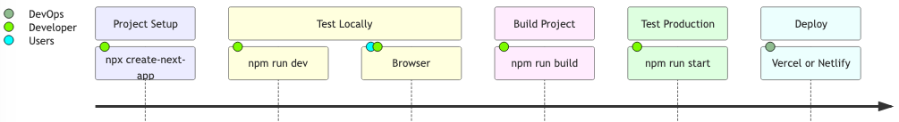

# Introduction:
| Feature                  | React                       | Next.js                         |
|--------------------------|-----------------------------|---------------------------------|
| **Type**                 | Library                     | Framework                       |
| **Rendering**            | Client-Side Rendering (CSR) | SSR, SSG, CSR, Hybrid           |
| **Routing**              | Requires React Router       | Built-in file-based routing     |
| **API Routes**           | Not available [^1]          | Built-in API routes [^2]        |
| **SEO**                  | Poor (CSR)                  | Excellent (SSR/SSG)             |
| **Performance**          | Slower initial load         | Faster (SSR/SSG)                |
| **Static Site Generation**| Not supported natively [^3] | Built-in SSG                    |
| **Deployment**           | Static files                | Static, SSR, or hybrid          |
| **Learning Curve**       | Lower                       | Higher (requires React knowledge) |

[^1]: You need to set up a separate backend (e.g., Node.js, Express) to handle API requests.
[^2]: You can create backend endpoints directly within your Next.js application by adding files to the `pages/api` directory.
[^3]: You would need to use additional tools like `Gatsby` to generate static sites.

## Workflow



## Folder Structure
```
my-next-app/
├── .next/                  # Next.js build output (automatically generated)
├── node_modules/           # Installed dependencies (automatically generated)
├── public/                 # Static assets (e.g., images, fonts)
│   ├── vercel.svg          # Example static file
│   └── favicon.ico         # Favicon
├── app/                    # App Router (replaces `pages`)
│   ├── (auth)/             # Route group (optional)
│   │   └── login/          # Nested route
│   │       └── page.js     # Login page
│   ├── about/              # Route segment
│   │   └── page.js         # About page
│   ├── api/                # API routes
│   │   └── hello/          # API route
│   │       └── route.js    # API handler
│   ├── layout.js           # Root layout
│   ├── page.js             # Home page
│   └── globals.css         # Global styles
├── .gitignore              # Files to ignore in Git
├── eslint.config.mjs       # ESLint configuration, used to find and fix problems in JS code
├── jsconfig.json           # JavaScript configuration (e.g., path aliases)
├── next.config.mjs         # Next.js configuration, mjs indicate that it uses ES Modules (ESM) syntax
├── package-lock.json       # Dependency lock file (if using npm)
├── package.json            # Project dependencies and scripts
├── postcss.config.mjs      # PostCSS configuration
├── tailwind.config.mjs     # Tailwind CSS configuration
└── README.md               # Project documentation

```

## NextJS uses ES6 Standard
ES6 defines the JavaScript programming language.

### Key features
1. `let`, replaces `var` and `const` for Variable Declarations
```javascript
let x = 10;
const y = 20; 
```
2. Arrow functions
```javascript
const add = (a, b) => a + b;
console.log(add(2, 3)); 
```
3. Template Literals
```javascript
const name = "Alice";
console.log(`Hello, ${name}!`); 
```
4. Destructuring Assignment
> Extract values from arrays or objects into variables.
```javascript
const [a, b] = [1, 2];
console.log(a, b);
```

5.  Default Parameters
> Set default values for function parameters.
```javascript
function greet(name = "Guest") {
  return `Hello, ${name}!`;
}
console.log(greet());
```
6. Spread and Rest Operators
> Spread (...): Expands an array or object into individual elements.
> 
> Rest (...): Collects multiple elements into an array.
```javascript
// Spread
const arr = [1, 2, 3];
const newArr = [...arr, 4, 5];

// Rest
function sum(...numbers) {
    let total = 0;
    for (let num of numbers) {
        total += num;
    }
    return total;
}

console.log(sum(1, 2, 3));
```
7. Classes
> Makes object-oriented programming easier.
```javascript
class Person {
  constructor(name) {
    this.name = name;
  }
  greet() {
    console.log(`Hello, ${this.name}!`);
  }
}
const alice = new Person("Alice");
alice.greet();
```
8. Modules
```javascript
// math.js
export const add = (a, b) => a + b;

// app.js
import { add } from './math.js';
console.log(add(2, 3));
```
9. 
